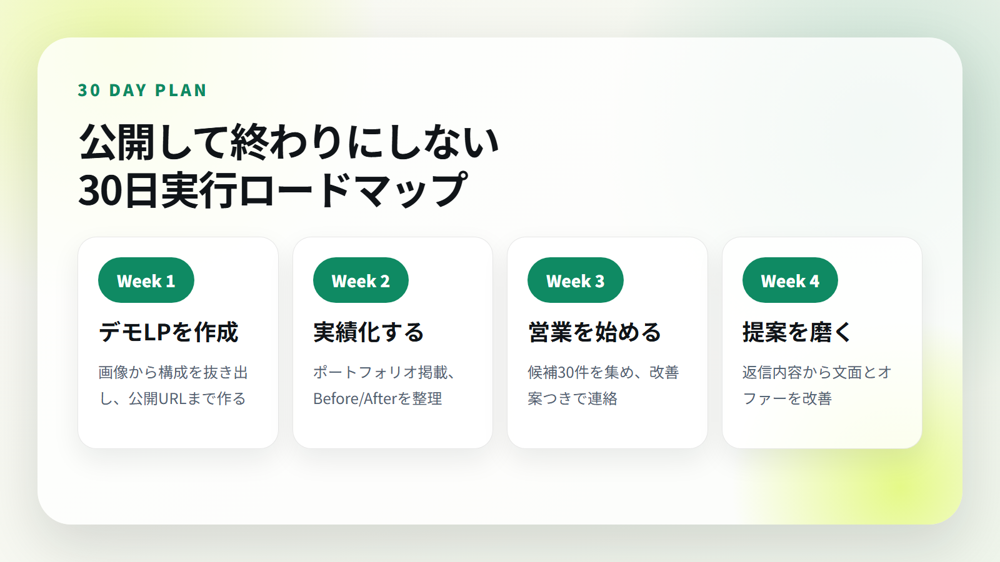
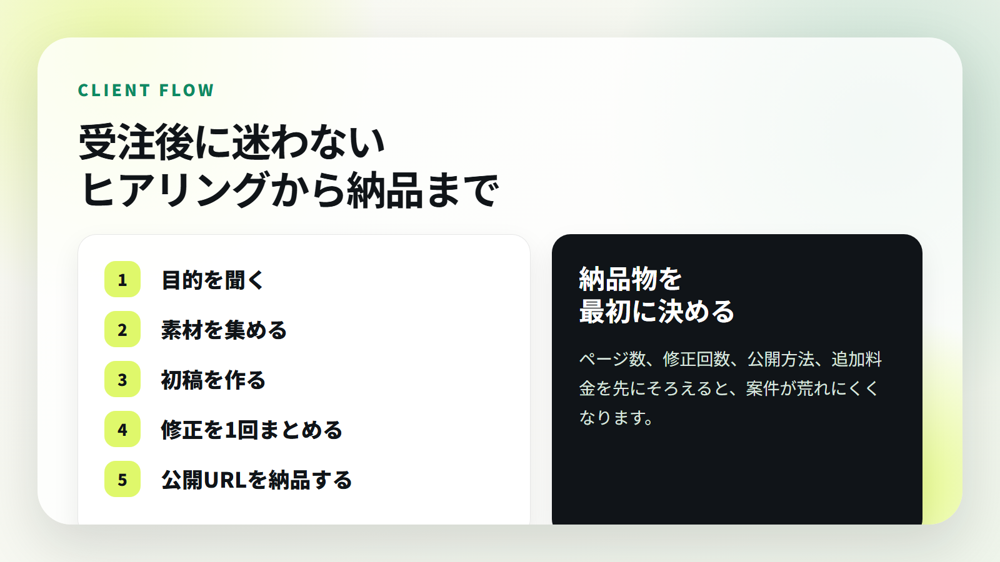
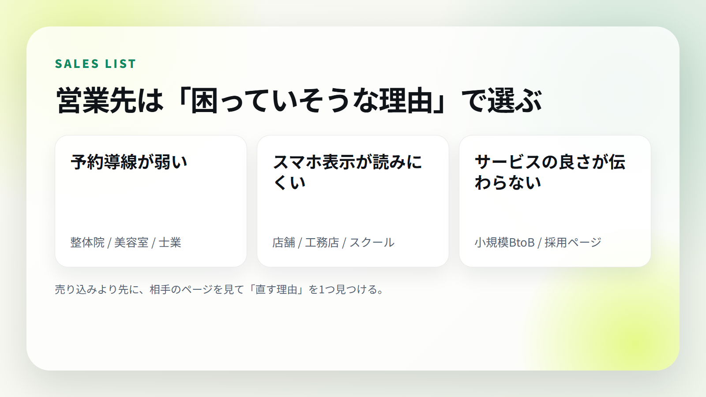

# 【実践キット】画像1枚からLPを作り、公開して、営業するまで。AI LP制作ロードマップ


こんにちは。

このnoteは、AIを使ってLP制作を始めたい人向けに、**参考画像1枚からLPを作り、GitHub / Vercelで公開し、ポートフォリオに載せ、営業まで進める流れ**をまとめた実践キットです。

「AIでサイトを作れます」という話だけでは、まだ仕事になりません。

仕事にするには、次の流れが必要です。

- 参考になるLPや画像を選ぶ
- AIに構成を分解させる
- Codex / ChatGPTでLPを実装する
- GitHubにアップする
- Vercelで公開する
- 公開URLとスクリーンショットをポートフォリオに載せる
- 営業先を探す
- 改善案つきで連絡する
- 返信を見て提案を直す

つまり、**作って終わりではなく、見せて、提案して、案件化するところまで**が大事です。


## この教材で目指す状態

この教材で目指すのは、いきなり大きな案件を取ることではありません。

まずは、次の状態を作ります。

- 公開済みのLPがある
- ポートフォリオに載せられる
- 営業文がある
- 営業先リストがある
- 初回案件の提案ができる
- 受注後のヒアリングと納品の流れが分かる

この状態になると、ただ「Web制作できます」と言うよりも、かなり営業しやすくなります。

## 月15万円を目指す考え方


月15万円を目指すなら、考え方はシンプルです。

- 5万円のLP制作を月3件
- 3万円の既存サイト改善を月5件
- 10万円のLP制作を月1件 + 小さな改善案件

このどれかを目指します。

もちろん、これは成果保証ではありません。営業量、提案内容、実績、相手の予算、市場状況で結果は変わります。

ただ、最初から30万円、50万円の大型案件だけを狙うより、**小さく作れて、実績にしやすいLP制作や改善提案から入るほうが現実的**です。

## この教材が向いている人

- AIを使ってWeb制作を始めたい人
- LP制作を副業にしたい人
- Vercel公開で毎回つまずく人
- ポートフォリオに載せる実績を作りたい人
- 営業文や提案文もAIで作りたい人
- 画像からLPの方向性を作る流れを知りたい人

逆に、次の人には向いていません。

- 何もしなくても自動で稼げる方法を探している人
- 成果保証を求めている人
- 営業や改善を一切したくない人
- AIに丸投げして確認もしたくない人

AIは制作を速くしてくれますが、最後に見るのは人間です。


## 教材内容

このnoteには、以下をまとめています。

- AI LP制作ロードマップ
- 参考画像からLP要件を作るプロンプト
- Codex / ChatGPTにLPを実装させるプロンプト
- GitHub / Vercel公開チェック
- ポートフォリオ掲載チェック
- 営業メール / DMテンプレート
- 営業リスト作成テンプレート
- 顧客ヒアリングシート
- 納品・修正文面テンプレート
- 30日営業ロードマップ
- Vercel / GitHubエラー対応
- 販売時の注意点


## 価格

この教材は **20,000円** です。

理由は、単なる読み物ではなく、LP制作から営業まで実際に使えるテンプレート集として作っているからです。

1件でも小さなLP制作や改善案件につながれば回収しやすい価格にしています。

ただし、繰り返しますが、成果を保証する教材ではありません。収益はスキル、営業量、提案内容、市場状況によって変わります。

---

ここから先は、実際のロードマップ、プロンプト、テンプレート、チェックリストです。

※ noteでは、この直前に有料エリアの区切りを入れてください。

---

# ここから有料部分

## 1. 全体の流れ

AI LP制作は、次の5ステップで進めます。

1. 参考画像や参考サイトを用意する
2. AIにLP構成を分解させる
3. LPを実装する
4. GitHub / Vercelで公開する
5. 実績化して営業する

大事なのは、最初から完璧を狙わないことです。

まずは「公開できる」「見せられる」「提案できる」状態まで持っていきます。

## 2. 最初に狙いやすい業種

最初は、予約や問い合わせが売上に直結しやすい業種を選びます。

- 整体院、整骨院
- 美容室、ネイル、エステ
- パーソナルジム
- 工務店、リフォーム
- 車検、整備工場
- 保険相談、士業
- 小規模スクール

これらは、LPで改善できるポイントが見つけやすいです。

- ファーストビューで何屋さんか分かりにくい
- 予約ボタンが目立たない
- スマホ表示が読みにくい
- 料金や流れが分かりにくい
- 口コミや実績が弱い
- FAQがない

## 3. 参考画像からLP要件を作るプロンプト

まず、参考画像をAIに渡して構成を分解させます。

```text
あなたはLP制作ディレクターです。
添付した参考画像をもとに、同じ雰囲気のLPを制作するための要件を整理してください。

出力してほしい内容:
- ターゲット
- デザインコンセプト
- カラーパレット
- ファーストビュー構成
- 必要セクション
- CTA設計
- スマホ表示で重要な注意点
- 実装時の注意点

ただし、丸パクリではなく、別案件として自然に使える構成にしてください。
```

## 4. Codex / ChatGPTにLPを実装させるプロンプト

```text
あなたはReact / Vite / Vercel向けのフロントエンドエンジニアです。

以下の要件でLPを作ってください。

目的:
{業種}向けの問い合わせ・予約につながる1ページLP

デザイン:
{参考画像の雰囲気}

必要セクション:
- ヘッダー
- ファーストビュー
- 悩み訴求
- サービス内容
- 選ばれる理由
- 施術 / サービスの流れ
- 料金
- 口コミ
- FAQ
- CTA
- フッター

実装条件:
- Vite + React
- PC / スマホ対応
- npm run build成功
- 画像は public/images に配置
- CTAは目立つように
- テキストがはみ出さないように
- 高級感と信頼感を保つ
```

## 5. AIに任せる部分、人間が見る部分

AIに任せてよい部分：

- LP構成の分解
- 初期実装
- 営業文の下書き
- 改善案の洗い出し
- READMEや手順書の作成

人間が見るべき部分：

- 画像の違和感
- 文字の読みやすさ
- スマホ表示
- CTAの押しやすさ
- 営業先に合っているか
- 法的に誤解を招く表現がないか

AIは速いですが、確認なしで出すと雑になります。

## 6. Vercel公開で見るポイント

Viteの場合、基本は次の設定です。

- Build Command: `npm run build`
- Output Directory: `dist`

静的HTMLを `public` に出す構成なら、Output Directoryは `public` です。

よくある失敗：

- Output Directoryが違う
- 画像パスが本番で崩れる
- `npm run build` がローカルで失敗している
- package.jsonにbuild scriptがない
- GitHubに最新コードがpushされていない

## 7. 公開前チェック


公開前に必ず見る項目です。

- PCで崩れていない
- スマホで文字が読める
- CTAがすぐ見つかる
- 画像が表示されている
- 料金や流れが分かる
- FAQがある
- `npm run build` が成功している
- GitHubにpushできている
- Vercelの最新デプロイが成功している

## 8. ポートフォリオに載せる

LPを公開したら、必ず実績化します。

載せるもの：

- サイト名
- 公開URL
- ファーストビューのスクリーンショット
- 制作説明
- 使用技術
- 何を改善したか

説明文の例：

```text
整体院向けに、信頼感、予約導線、スマホ体験を重視して制作したランディングページ。
ファーストビュー、悩み訴求、施術の流れ、FAQ、固定CTAまで設計し、問い合わせ前の不安を減らす構成にしました。
```

## 9. 30日実行ロードマップ



### Week 1: 見せられる実績を作る

- 業種を1つ選ぶ
- 参考画像を1枚決める
- AIに構成を出させる
- LPを作る
- GitHub / Vercelで公開する
- スクリーンショットを撮る
- ポートフォリオに載せる

### Week 2: 営業材料を整える

- 制作意図を3行で書く
- Before / Afterの説明を作る
- 営業文を3パターン作る
- 業種別の改善ポイントを整理する

### Week 3: 営業先を30件集める

- Googleマップ
- Instagram
- 地域名 + 業種
- 古いサイトの事業者
- 予約導線が弱い店舗

### Week 4: 送って改善する

- 1日2件から3件送る
- 反応があった文面を保存する
- 反応がない文面は短くする
- 相手別の改善案を1つ入れる

## 10. 受注後の流れ



受注後に迷わないために、最初に次を決めます。

- 納品物
- 修正回数
- 公開方法
- 納期
- 追加料金
- 素材を誰が用意するか

曖昧なまま始めると、あとで修正が増えやすくなります。

ヒアリングでは、最低限これを聞きます。

- 事業内容
- 一番売りたいサービス
- 来てほしいお客様
- お客様が不安に思うこと
- 競合と比べた強み
- CTA
- 参考サイト
- NGデザイン

## 11. 営業先の選び方



営業先は、ただ数を集めるだけでは弱いです。

「なぜ改善できそうか」を見つけてから送ります。

見るポイント：

- 予約ボタンが見つけやすいか
- スマホで読みやすいか
- 料金が分かりやすいか
- 写真が古くないか
- 口コミや実績があるか
- 問い合わせ前の不安が消えているか

## 12. 営業文の型


営業文は、売り込み感を減らすのがコツです。

基本の型：

1. 相手の良い点を1つ伝える
2. 改善できそうな点を1つだけ伝える
3. 無料で改善ラフを作れると伝える
4. 返信ハードルを下げる

## 13. フォーム営業テンプレート

```text
突然のご連絡失礼いたします。
Web制作を行っている{名前}と申します。

貴社のサイトを拝見し、{良い点} がとても伝わりやすいと感じました。

一方で、スマートフォンで見た際に {改善点} を少し整えると、
問い合わせにつながりやすくなる可能性があると思いご連絡しました。

もしよろしければ、貴社向けに簡単な改善イメージを無料で1枚作成できます。
営業色の強い提案ではなく、まずは「こう見せると伝わりやすい」というサンプルとしてご覧いただければ幸いです。

ご興味がありましたら、このメールに一言だけご返信ください。
よろしくお願いいたします。
```

## 14. DMテンプレート

```text
はじめまして。
{地域・業種}向けに、予約や問い合わせにつながるLP制作をしています。

投稿とサイトを拝見して、{良い点} が魅力的だと感じました。

もしLPのファーストビューを少し整えるなら、{改善案} ができそうです。

よければ無料で簡単な改善ラフを1枚作れます。
必要なければスルーで大丈夫です。
```

## 15. 追客テンプレート

```text
先日ご連絡した{名前}です。

念のため、貴社サイトで改善できそうな点を3つだけまとめました。

1. {改善点1}
2. {改善点2}
3. {改善点3}

すぐ制作の話でなくても大丈夫です。
「今のサイトでどこを直すと問い合わせにつながりやすいか」だけでもお伝えできます。
```

## 16. 購入者向け追加テンプレート

このリポジトリには、note本文とは別に以下のテンプレートも入れています。

- `note/bonus/00-start-here.md`
- `note/bonus/01-offer-sheet.md`
- `note/bonus/02-client-hearing-sheet.md`
- `note/bonus/03-sales-list-template.csv`
- `note/bonus/04-delivery-and-revision-templates.md`
- `note/bonus/05-vercel-github-troubleshooting.md`
- `note/bonus/06-30day-sales-plan.md`
- `note/bonus/07-ai-prompts-expanded.md`

noteで配布する場合は、本文内にそのまま貼るか、購入者特典として別途渡してください。

## 17. 販売・実践時の注意

情報商材として販売する場合は、以下を必ず整えてください。

- 特定商取引法に基づく表記
- プライバシーポリシー
- 返金条件
- 問い合わせ先
- 提供方法
- 成果保証ではない旨の注意書き

注意書き例：

```text
本教材は成果を保証するものではありません。
収益はスキル、営業量、提案内容、市場状況によって変動します。
教材内容を実践した場合でも、必ず案件獲得や売上発生を保証するものではありません。
```

## 最後に

AIでLPを作れるだけでは、まだ仕事にはなりません。

仕事にするには、

- 作る
- 公開する
- 見せる
- 提案する
- 改善する

この流れを回す必要があります。

まずは1本、公開URLつきのLPを作ってください。

それを実績として見せながら、営業文を送り、反応を見て改善する。

ここからがスタートです。
