# 【実践キット】画像1枚からLPを作り、Vercelで公開し、営業までAIに任せるロードマップ

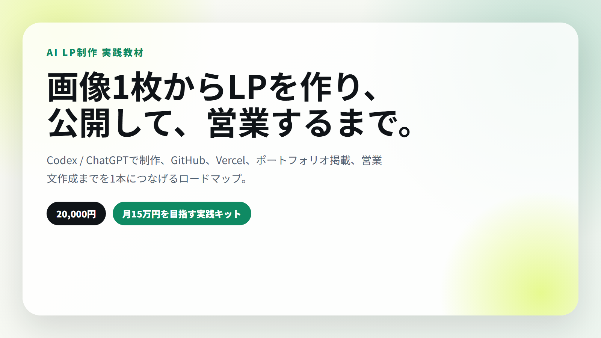

このnoteは、AIでLPを作って終わりにしないための実践教材です。

テーマは、**画像1枚からLPを作り、GitHubに上げ、Vercelで公開し、ポートフォリオに載せ、営業文までAIで作る**こと。

「AIでサイト作れます」だけでは、まだ売れません。

売るためには、次の状態が必要です。

- 見せられる公開URLがある
- 実績として載せられるスクリーンショットがある
- 何を改善したか説明できる
- 営業先を選べる
- 営業文を作れる
- 受注後にヒアリング、修正、納品まで進められる

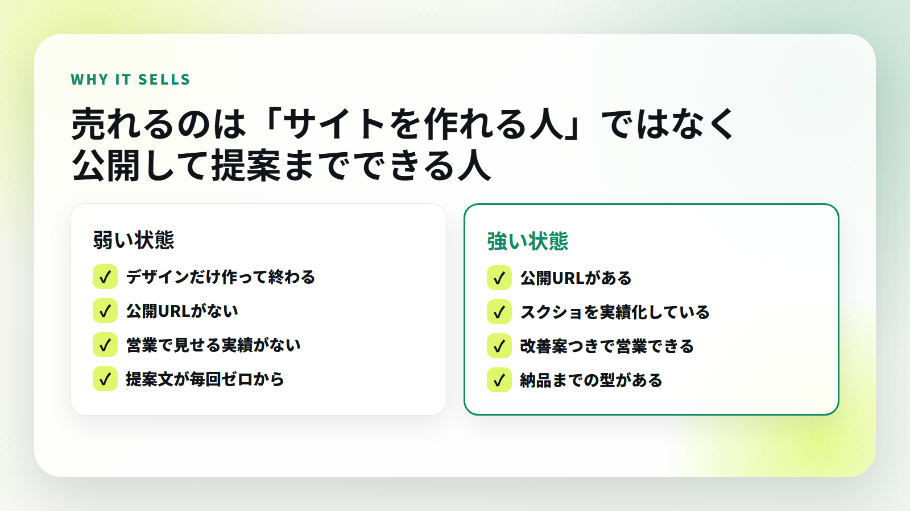

## この教材で作るもの

この教材で作るのは、ただのデモサイトではありません。

**営業に使えるLP制作実績**です。

整体院、美容室、ジム、士業、工務店、保険相談などの小規模事業者向けに、問い合わせや予約につながる1ページLPを作ります。

完成したら、公開URLを作り、ポートフォリオに載せ、営業文の中で見せます。ここまでやることで、相手に「この人は実際に作れる」と伝わります。

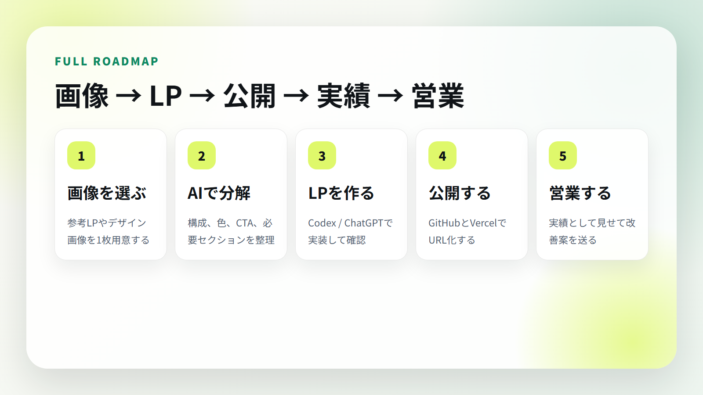

## 無料部分で伝えたい結論

LP制作で大事なのは、デザインセンスだけではありません。

大事なのは、次の5つをつなげることです。

1. 参考画像から構成を読む
2. AIでLPを実装する
3. 公開URLを作る
4. 実績として見せる
5. 改善案つきで営業する

この5つをつなげられる人は、ただAIを触っている人よりも案件化しやすくなります。

## 月15万円を目指す考え方

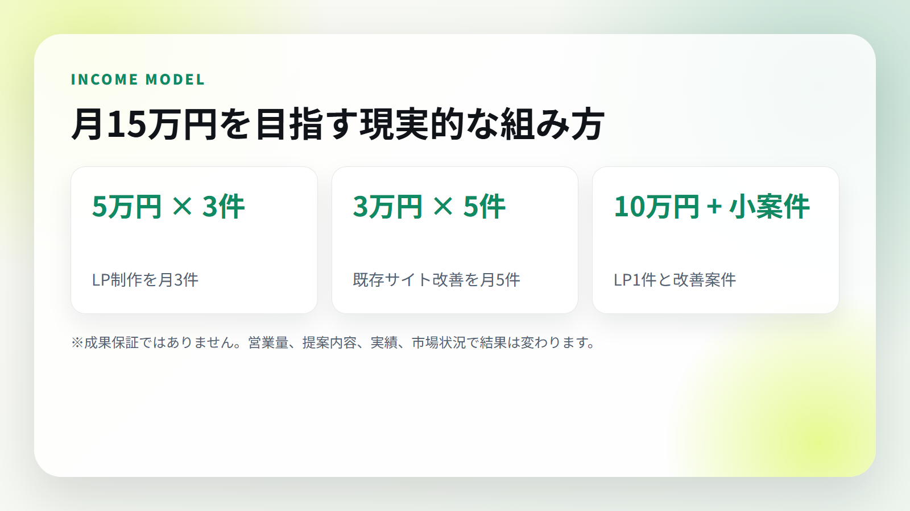

月15万円を目指す場合、考え方はシンプルです。

- 5万円のLP制作を月3件
- 3万円のサイト改善を月5件
- 10万円のLP制作1件 + 小さな改善案件

もちろん、これは成果保証ではありません。

営業量、実績、提案内容、相手の予算、市場状況によって結果は変わります。

ただ、最初から高単価だけを狙うより、**小さく作れて、実績化しやすく、営業で見せやすいLP制作から始める**ほうが現実的です。

## この教材に入っているもの

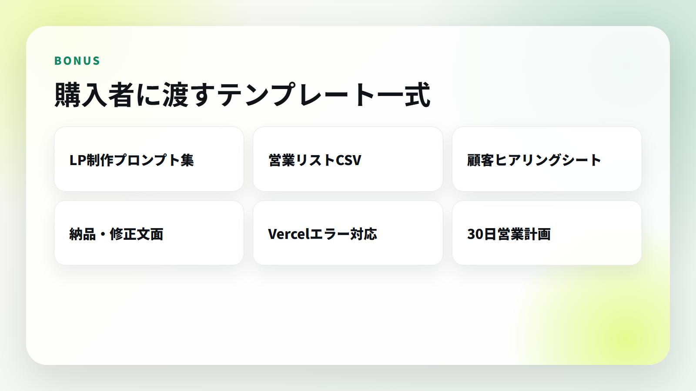

このnoteには、本文だけでなく、実際に使うテンプレートも入れています。

- 参考画像からLP要件を作るプロンプト
- Codex / ChatGPTにLPを作らせるプロンプト
- GitHub / Vercel公開手順
- Vercelエラー対応
- ポートフォリオ掲載チェック
- 営業リストCSV
- 営業メール / DMテンプレート
- 顧客ヒアリングシート
- 納品、修正文面テンプレート
- 30日営業ロードマップ

## 価格

この教材は **20,000円** です。

単なる読み物ではなく、LP制作から公開、営業、納品まで使うためのテンプレート集として作っています。

1件でも小さなLP制作や改善案件につながれば回収しやすい価格にしています。

ただし、本教材は成果を保証するものではありません。収益はスキル、営業量、提案内容、市場状況によって変動します。

---

ここから先は、有料部分です。

画像つきで、実際の作業順に進めます。

※ noteでは、この直前に有料エリアの区切りを入れてください。

---

# ここから有料部分

## 1. まず「売れる流れ」を理解する


最初に理解してほしいのは、AI LP制作は「コードを書けるか」だけではないということです。

案件化するには、この流れが必要です。

1. 画像を選ぶ
2. AIで構成を分解する
3. LPを作る
4. GitHub / Vercelで公開する
5. 実績化して営業する

この流れを作ると、営業文で「こういうものを作れます」と実物を見せられます。

逆に、公開URLもスクリーンショットもない状態で営業すると、相手は判断できません。

## 2. 参考画像からLPの設計図を作る

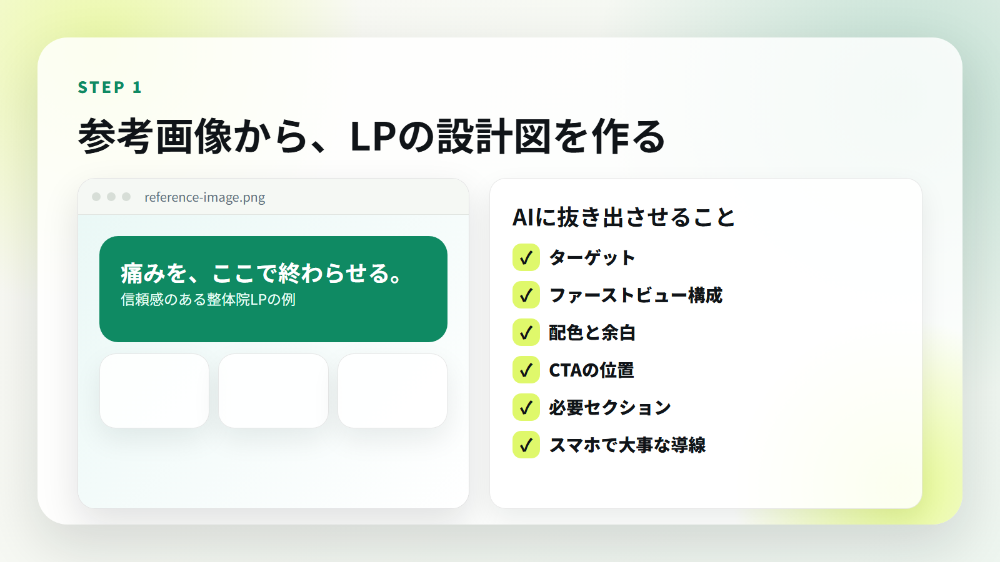

最初にやるのは、参考画像を1枚選ぶことです。

ここで大事なのは、画像をそのままコピーすることではありません。

参考画像から、以下を抜き出します。

- 誰向けのLPか
- ファーストビューで何を伝えているか
- どんな色と余白を使っているか
- CTAはどこにあるか
- どの順番で不安を消しているか
- スマホで見たときに何が重要か

この作業をAIにやらせると、LPの設計図ができます。

## 3. 参考画像を読み解くプロンプト

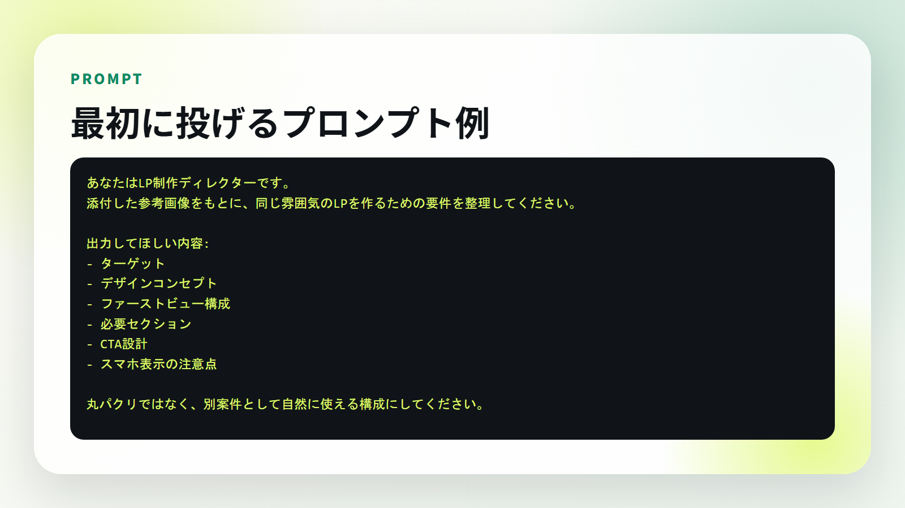

まず、このプロンプトを使います。

```text
あなたはLP制作ディレクターです。
添付した参考画像をもとに、同じ雰囲気のLPを作るための要件を整理してください。

出力してほしい内容:
- ターゲット
- デザインコンセプト
- ファーストビュー構成
- 必要セクション
- CTA設計
- スマホ表示の注意点

丸パクリではなく、別案件として自然に使える構成にしてください。
```

AIの回答が出たら、そのまま使うのではなく、次の観点で整えます。

- 業種に合っているか
- CTAが明確か
- 料金や流れが入っているか
- 信頼材料があるか
- スマホで読みやすいか

## 4. CodexにLP制作を依頼する

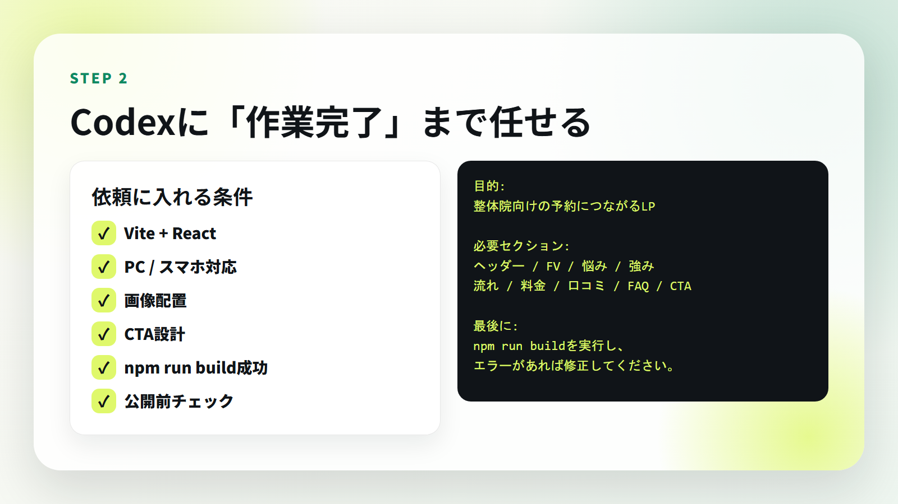

次に、Codex / ChatGPTに実装を依頼します。

依頼文には、必ず次を入れます。

- 何の業種向けか
- 何を目的にするか
- 必要なセクション
- デザインの方向性
- 技術条件
- ビルド確認までやってほしいこと

コピペ用プロンプト：

```text
あなたはReact / Vite / Vercel向けのフロントエンドエンジニアです。

以下の要件でLPを作ってください。

目的:
{業種}向けの問い合わせ・予約につながる1ページLP

デザイン:
{参考画像の雰囲気}

必要セクション:
- ヘッダー
- ファーストビュー
- 悩み訴求
- サービス内容
- 選ばれる理由
- サービスの流れ
- 料金
- 口コミ
- FAQ
- CTA
- フッター

実装条件:
- Vite + React
- PC / スマホ対応
- npm run build成功
- 画像は public/images に配置
- CTAは目立つように
- テキストがはみ出さないように
- 高級感と信頼感を保つ

最後に npm run build を実行し、エラーが出たら修正してください。
```

ここでのポイントは、AIに「作って」とだけ言わないことです。

**ビルド成功まで確認してほしい**と明確に入れます。

## 5. GitHubに上げる

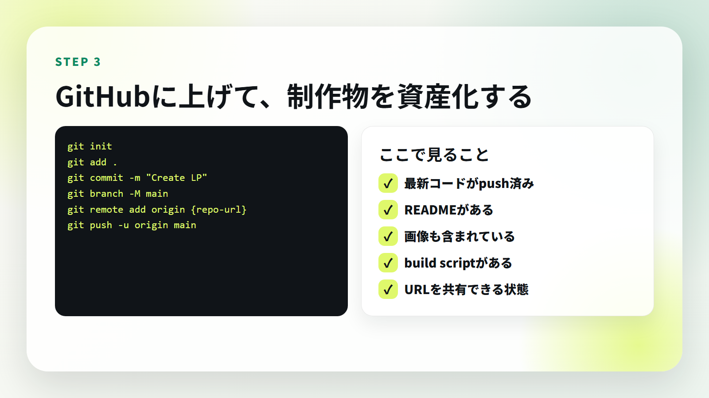

LPができたら、GitHubに上げます。

GitHubに上げる理由は、Vercel公開のためだけではありません。制作物を資産化するためです。

基本コマンド：

```bash
git init
git add .
git commit -m "Create LP"
git branch -M main
git remote add origin {repo-url}
git push -u origin main
```

確認すること：

- 最新コードがpushされている
- 画像も含まれている
- `package.json` にbuild scriptがある
- READMEに概要がある
- Vercelが読み込める状態になっている

## 6. Vercelで公開する

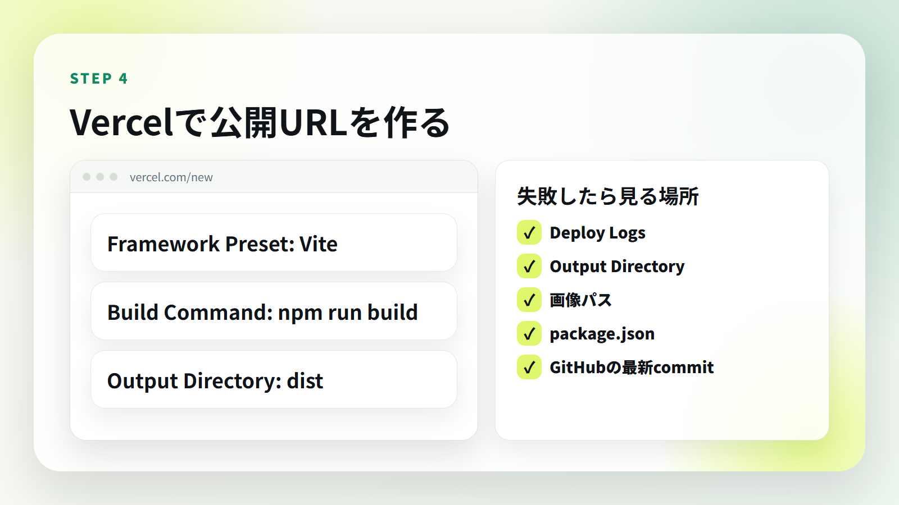

Viteで作ったLPなら、基本設定はこれです。

- Framework Preset: Vite
- Build Command: `npm run build`
- Output Directory: `dist`

Vercelで失敗したら、まず見る場所はこの5つです。

- Deploy Logs
- Output Directory
- 画像パス
- package.json
- GitHubの最新commit

特に多いのは、Output Directoryの間違いです。

Viteなら普通は `dist` です。

静的HTMLを自前で `public` に出している構成なら `public` になります。

## 7. よくあるエラー対応

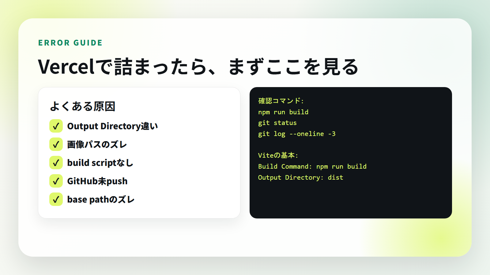

ビルドで詰まったら、エラー文をそのままAIに渡します。

```text
以下は npm run build のエラーログです。
原因を特定し、修正すべきファイルとコードを教えてください。
必要なら修正案も出してください。

ログ:
{エラーログ}
```

Vercelで詰まった場合：

```text
Vercelでデプロイエラーが出ています。
Deploy Logsを読み、原因と修正方法を教えてください。

確認してほしい点:
- Build Command
- Output Directory
- 画像パス
- package.json
- Viteのbase設定

ログ:
{Vercelのログ}
```

## 8. ポートフォリオに載せる

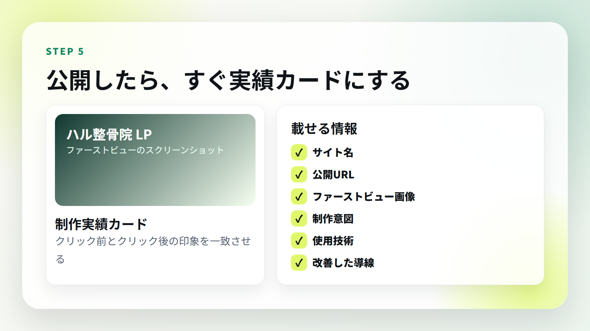

公開したLPは、すぐポートフォリオに載せます。

ここで大事なのは、素材写真ではなく、**実際のファーストビューのスクリーンショット**を載せることです。

クリック前のカードと、クリック後のサイトの印象が一致していると、信頼感が出ます。

載せる情報：

- サイト名
- 公開URL
- ファーストビュー画像
- 制作意図
- 使用技術
- どの導線を改善したか

説明文の例：

```text
整体院向けに、信頼感、予約導線、スマホ体験を重視して制作したランディングページ。
ファーストビュー、悩み訴求、施術の流れ、FAQ、固定CTAまで設計し、
問い合わせ前の不安を減らす構成にしました。
```

## 9. 営業先を選ぶ

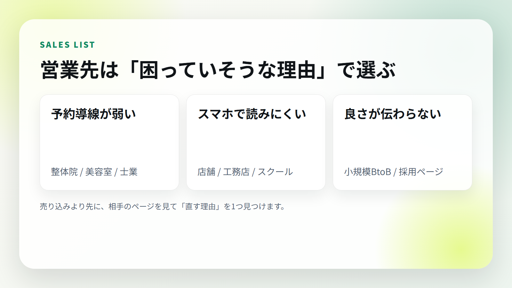

営業先は、ただ数を集めるだけでは弱いです。

「なぜこの相手に提案するのか」を見つけてから送ります。

見つけやすい改善ポイント：

- 予約ボタンが見つけにくい
- スマホで文字が読みにくい
- 料金が分かりにくい
- 写真が古い
- 口コミや実績が見つからない
- 問い合わせ前の不安が消えていない

営業リストには、次を入れます。

- 会社名
- 業種
- URL
- 良い点
- 改善できそうな点
- 提案する内容
- 連絡先
- 送信日
- 返信
- 次アクション

## 10. 営業文の作り方

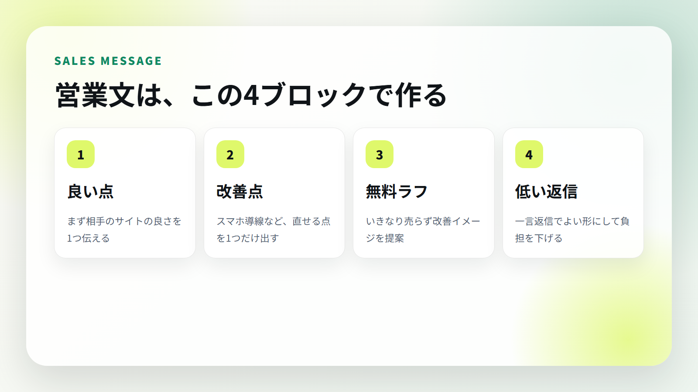

営業文は、売り込み感を減らします。

基本はこの4ブロックです。

1. 良い点を伝える
2. 改善点を1つだけ伝える
3. 無料ラフを作れると伝える
4. 一言返信でよい形にする

フォーム営業テンプレート：

```text
突然のご連絡失礼いたします。
Web制作を行っている{名前}と申します。

貴社のサイトを拝見し、{良い点} がとても伝わりやすいと感じました。

一方で、スマートフォンで見た際に {改善点} を少し整えると、
問い合わせにつながりやすくなる可能性があると思いご連絡しました。

もしよろしければ、貴社向けに簡単な改善イメージを無料で1枚作成できます。
営業色の強い提案ではなく、まずは「こう見せると伝わりやすい」というサンプルとしてご覧いただければ幸いです。

ご興味がありましたら、このメールに一言だけご返信ください。
よろしくお願いいたします。
```

DMテンプレート：

```text
はじめまして。
{地域・業種}向けに、予約や問い合わせにつながるLP制作をしています。

投稿とサイトを拝見して、{良い点} が魅力的だと感じました。

もしLPのファーストビューを少し整えるなら、{改善案} ができそうです。

よければ無料で簡単な改善ラフを1枚作れます。
必要なければスルーで大丈夫です。
```

## 11. 受注後の流れ

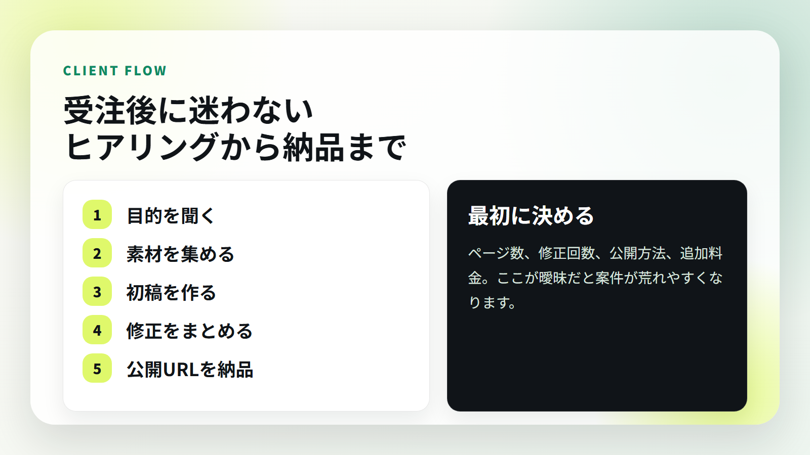

受注後に迷わないために、最初に決めます。

- 納品物
- 修正回数
- 公開方法
- 納期
- 追加料金
- 素材を誰が用意するか

ヒアリングで聞くこと：

- 事業内容
- 一番売りたいサービス
- 来てほしいお客様
- お客様が不安に思うこと
- 競合と比べた強み
- CTA
- 参考サイト
- NGデザイン

## 12. 納品前チェック

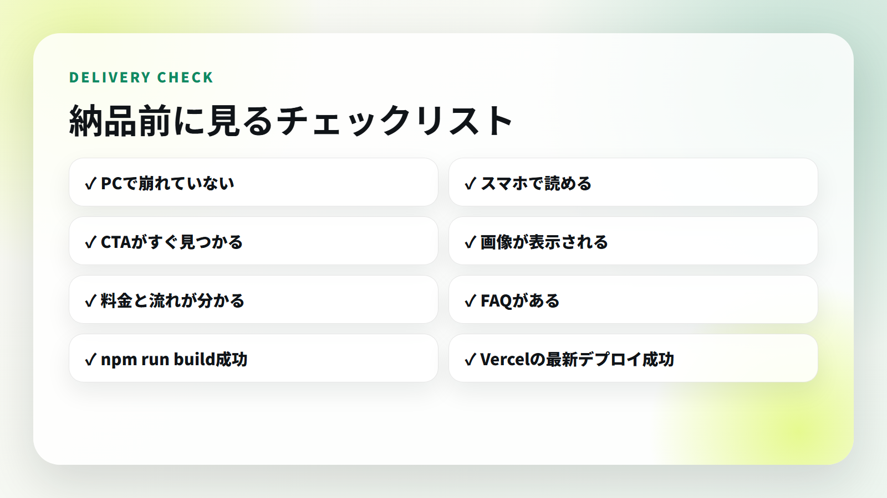

納品前は、必ず次を見ます。

- PCで崩れていない
- スマホで文字が読める
- CTAがすぐ見つかる
- 画像が表示されている
- 料金と流れが分かる
- FAQがある
- `npm run build` が成功している
- Vercelの最新デプロイが成功している

初稿提出テンプレート：

```text
お世話になっております。
LPの初稿ができましたので共有いたします。

公開確認URL:
{URL}

今回、特に意識した点は以下です。
- {意識した点1}
- {意識した点2}
- {意識した点3}

スマートフォンでも見やすいように、問い合わせ導線を目立たせています。
ご確認いただき、修正希望があればまとめてお送りください。
```

## 13. 30日実行ロードマップ

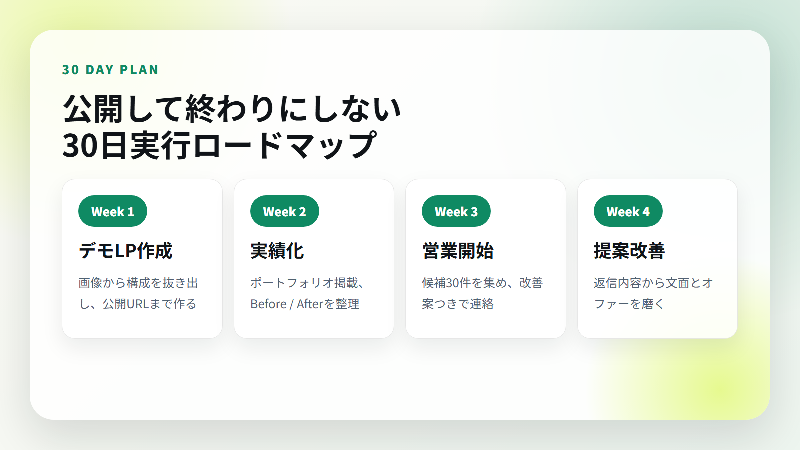

### Week 1: デモLPを作る

- 業種を1つ選ぶ
- 参考画像を1枚決める
- AIに構成を出させる
- LPを作る
- GitHub / Vercelで公開する
- スクリーンショットを撮る
- ポートフォリオに載せる

### Week 2: 営業材料を整える

- 制作意図を3行で書く
- Before / Afterの説明を作る
- 営業文を3パターン作る
- 業種別の改善ポイントを整理する

### Week 3: 営業先を30件集める

- Googleマップ
- Instagram
- 地域名 + 業種
- 古いサイトの事業者
- 予約導線が弱い店舗

### Week 4: 送って改善する

- 1日2件から3件送る
- 反応があった文面を保存する
- 反応がない文面は短くする
- 相手別の改善案を1つ入れる

## 14. 今日やること

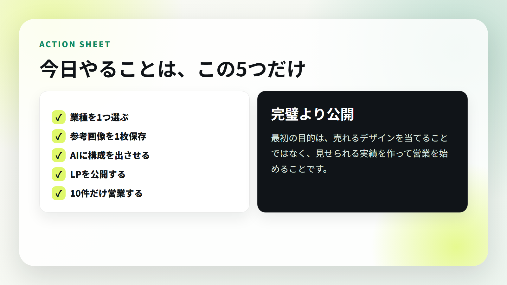

今日やることは、これだけです。

1. 業種を1つ選ぶ
2. 参考画像を1枚保存する
3. AIに構成を出させる
4. LPを公開する
5. 10件だけ営業する

最初から完璧なLPを作ろうとすると止まります。

まずは、公開URLつきの実績を1つ作ることを優先してください。

## 15. 追加テンプレート

購入者向けに、以下のファイルも用意しています。

- `note/bonus/00-start-here.md`
- `note/bonus/01-offer-sheet.md`
- `note/bonus/02-client-hearing-sheet.md`
- `note/bonus/03-sales-list-template.csv`
- `note/bonus/04-delivery-and-revision-templates.md`
- `note/bonus/05-vercel-github-troubleshooting.md`
- `note/bonus/06-30day-sales-plan.md`
- `note/bonus/07-ai-prompts-expanded.md`

note本文にそのまま貼ってもいいですし、購入者特典として別途配布しても使えます。

## 16. 販売時の注意

情報商材として販売する場合、最低限以下を整えてください。

- 特定商取引法に基づく表記
- プライバシーポリシー
- 返金条件
- 問い合わせ先
- 提供方法
- 成果保証ではない旨の注意書き

注意書き例：

```text
本教材は成果を保証するものではありません。
収益はスキル、営業量、提案内容、市場状況によって変動します。
教材内容を実践した場合でも、必ず案件獲得や売上発生を保証するものではありません。
```

## 最後に

AIでLPを作れるだけでは、まだ仕事にはなりません。

仕事にするには、

- 作る
- 公開する
- 見せる
- 提案する
- 改善する

この流れを回す必要があります。

まずは1本、公開URLつきのLPを作ってください。

それをポートフォリオに載せ、営業文で見せながら、反応を見て改善する。

この教材は、その最初の1本を作り、営業まで進めるための実践キットです。
