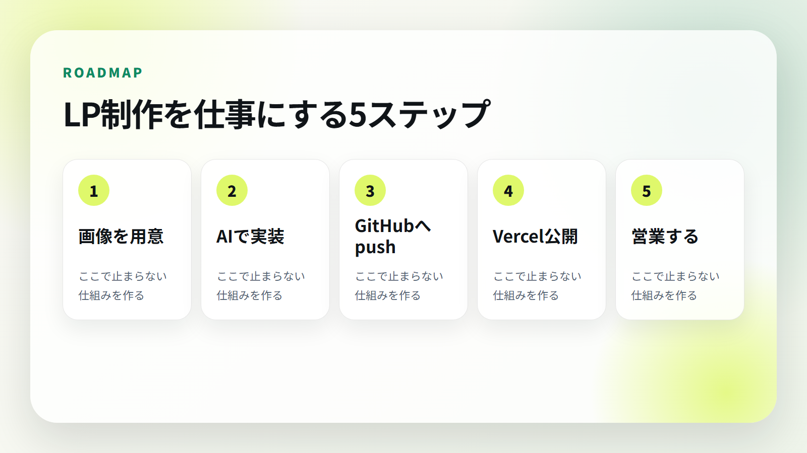
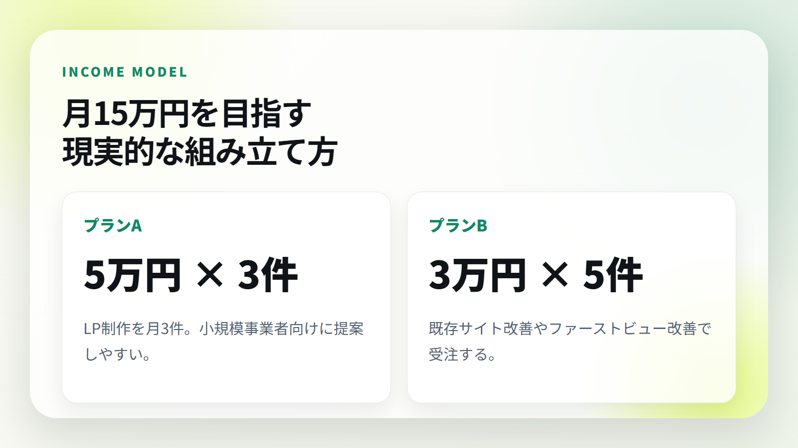
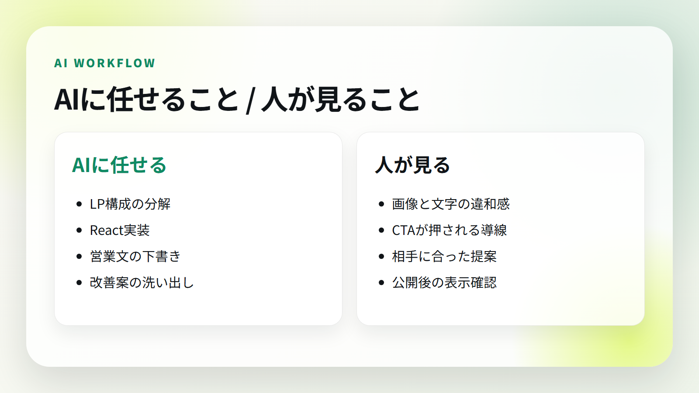
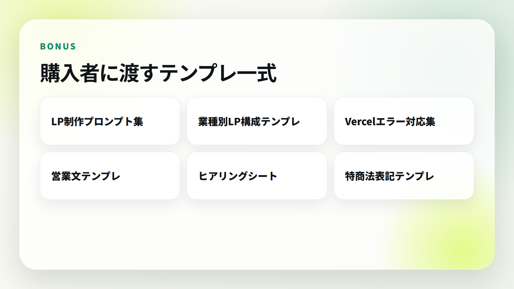
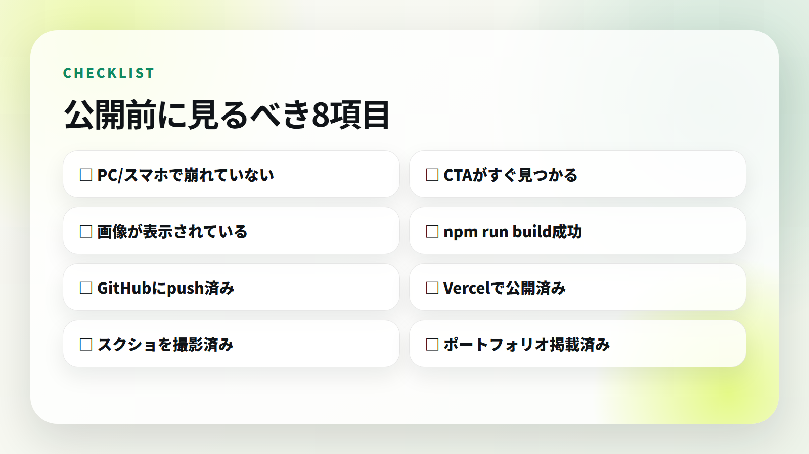
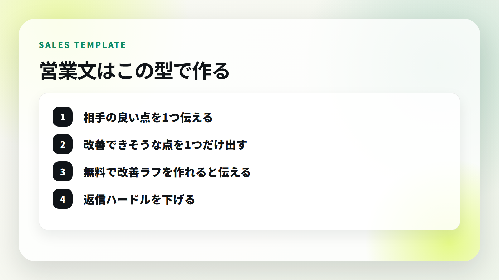

# 【実践キット】画像1枚からLPを作り、公開して、営業するまで。AI LP制作ロードマップ


こんにちは。  
この記事は、AIを使って **LP制作を仕事にするまでの流れ** を、できるだけ実務寄りにまとめたロードマップです。

ただ「AIでサイトが作れます」という話ではありません。

この記事で扱うのは、次の一連の流れです。

- LPの参考画像を用意する
- AIに構成を分解させる
- Codex / ChatGPTでLPを実装する
- GitHubに上げる
- Vercelで公開する
- 公開したサイトをポートフォリオに載せる
- AIで営業リストと営業文を作る
- 月15万円を目指す動き方に落とす

つまり、**作って終わりではなく、売るところまで** です。

## この教材で目指す状態



AIでLPを作れる人は増えました。

でも、実際にはここで止まる人が多いです。

- それっぽい画面は作れたけど、公開できない
- GitHubやVercelで詰まる
- ポートフォリオに載せられない
- 営業文が作れない
- 誰に売ればいいか分からない

逆に言うと、ここを一気通貫でできるだけで、かなり差がつきます。

この教材では、LP画像から公開、営業までを1本の作業フローとして整理しています。

## 月15万円を目指す考え方



月15万円を目指すなら、考え方はシンプルです。

- 5万円のLP制作を月3件
- 3万円の既存サイト改善を月5件
- 2万円のファーストビュー改善を月8件

このどれかを狙います。

もちろん、これは成果保証ではありません。  
営業量、提案先、制作スピード、実績、相手の予算によって結果は変わります。

ただ、最初から30万円、50万円の大型案件を狙うより、**小さく作れるLPや改善提案から入る方が現実的** です。

## この教材が向いている人

- AIを使ってWeb制作を始めたい人
- LP制作を副業にしたい人
- Codex / ChatGPTでサイト制作を効率化したい人
- GitHubやVercel公開で毎回つまずく人
- ポートフォリオに載せる実績を作りたい人
- 営業文や提案文をAIに任せたい人

逆に、以下の人には向いていません。

- 何もしなくても自動で稼げる方法を探している人
- 成果保証を求めている人
- 営業や改善を一切したくない人
- AIに丸投げして確認もしたくない人

AIはかなり強いですが、最後に見るのは人間です。



## 教材内容

このnoteには、以下をまとめています。

- AI LP制作ロードマップ
- LP制作プロンプト集
- GitHub / Vercel公開チェックリスト
- ポートフォリオ掲載チェックリスト
- 営業メール / DMテンプレート
- 営業リスト作成プロンプト
- 特定商取引法に基づく表記テンプレート
- 販売時の注意事項



## 価格

この教材は **20,000円** です。

理由は、単なる読み物ではなく、LP制作から営業までを実務で使える形にしたテンプレート集だからです。

1件でも小さなLP制作や改善案件につながれば、回収しやすい価格にしています。

---

ここから先は、実際のロードマップ、プロンプト、営業テンプレート、チェックリストです。

※本教材は成果を保証するものではありません。収益はスキル、営業量、提案内容、市場状況によって変動します。

---

# ここから有料部分

## 1. AI LP制作の全体像

最初に理解しておくべきことは、AI LP制作は「コードを書く技術」だけではないということです。

必要なのはこの5つです。

1. 参考画像や業種からLP構成を読み取る
2. AIに正しく制作指示を出す
3. 生成されたサイトを確認・修正する
4. GitHub / Vercelで公開する
5. 実績化して営業に使う

この流れを毎回同じ型で回せるようにします。

## 2. 最初に狙いやすい業種

最初は、予約や問い合わせが売上に直結する業種を狙います。

おすすめは以下です。

- 整骨院、整体院
- 美容室、プライベートサロン
- パーソナルジム
- 工務店、リフォーム
- 車検、整備工場
- 保険相談、士業
- 小規模スクール

これらは、LPで改善できるポイントが多いです。

- ファーストビューで何屋さんか分かりにくい
- 予約ボタンが目立たない
- スマホ表示が読みにくい
- 料金や流れが分かりにくい
- 口コミや実績が弱い

## 3. 参考画像からLP要件を整理するプロンプト

以下をAIに投げます。

```text
あなたはLP制作ディレクターです。
添付した参考画像をもとに、同じ雰囲気のLPを制作するための要件を整理してください。

出力してほしい内容:
- ターゲット
- デザインコンセプト
- カラーパレット
- ファーストビュー構成
- 必要セクション
- CTA設計
- スマホ表示で重要な導線
- 実装時の注意点

ただし、丸パクリではなく、別案件として自然に使える構成にしてください。
```

## 4. CodexにLPを実装させるプロンプト

```text
あなたはReact / Vite / Vercel向けのフロントエンドエンジニアです。

以下の要件でLPを作ってください。

目的:
{業種}向けの問い合わせ・予約につながる1ページLP

デザイン:
{参考画像の雰囲気}

必須セクション:
- ヘッダー
- ファーストビュー
- 悩み訴求
- サービス内容
- 選ばれる理由
- 施術/サービスの流れ
- 料金
- 口コミ
- FAQ
- CTA
- フッター

実装条件:
- Vite + React
- PC/スマホ対応
- npm run build 成功
- 画像は public/images に配置
- CTAは目立つように
- テキストがはみ出さないように
```

## 5. AIに任せる部分、人間が見る部分

AIに任せてよい部分:

- LP構成の分解
- 初期実装
- 営業文の下書き
- 改善案の洗い出し
- READMEや手順書の作成

人間が見るべき部分:

- 画像の違和感
- 文字の読みやすさ
- スマホ表示
- CTAの押しやすさ
- 営業先に合っているか
- 法的に誤解を招く表現がないか

## 6. Vercel公開で見るポイント

Viteなら基本は以下です。

- Build Command: `npm run build`
- Output Directory: `dist`

静的HTMLで `public/` に出す構成なら、Output Directoryは `public` です。

よくある失敗:

- Output Directoryが違う
- 画像パスが本番で崩れる
- `npm run build` がローカルで失敗している
- package.jsonにbuild scriptがない
- GitHubに最新コードがpushされていない

## 7. ポートフォリオ掲載チェック

LPを作ったら、必ず実績化します。

チェック項目:



- 公開URLがある
- PC/スマホで見た目を確認した
- ファーストビューのスクリーンショットを撮った
- 制作実績カードに載せた
- 説明文に「何を改善したか」を入れた
- GitHub URLも載せた

説明文の例:

```text
整骨院向けに、信頼感・予約導線・スマホ体験を重視して制作したランディングページ。
ファーストビュー、症状カード、FAQ、固定CTAまで設計。
```

## 8. 営業文の型

営業文は、売り込み感を減らすのがコツです。



基本の型:

1. 相手の良い点を1つ伝える
2. 改善できそうな点を1つだけ出す
3. 無料で改善ラフを作れると伝える
4. 返信ハードルを下げる

## 9. フォーム営業テンプレート

```text
突然のご連絡失礼いたします。
Web制作を行っている{名前}と申します。

貴社のサイトを拝見し、{良い点}がとても伝わりやすいと感じました。
一方で、スマートフォンで見た際に{改善点}を少し整理すると、問い合わせにつながりやすくなる可能性があると思いご連絡しました。

もしよろしければ、貴社向けに簡単な改善イメージを無料で1枚作成できます。
営業色の強いご提案ではなく、まずは「こう見せると伝わりやすい」というサンプルとしてご覧いただければ幸いです。

ご興味がありましたら、このメールに一言だけご返信ください。
よろしくお願いいたします。
```

## 10. DMテンプレート

```text
はじめまして。
{地域/業種}向けに、予約や問い合わせにつながるLP制作をしています。

投稿とサイトを拝見して、{良い点}が魅力的だと感じました。
もしLPのファーストビューを少し整えるなら、{改善案}ができそうです。

よければ無料で簡単な改善ラフを1枚作ります。
必要なければスルーで大丈夫です。
```

## 11. 追客テンプレート

```text
先日ご連絡した{名前}です。

念のため、貴社サイトで改善できそうな点を3つだけまとめました。

1. {改善点1}
2. {改善点2}
3. {改善点3}

すぐ制作の話でなくても大丈夫です。
「今のサイトでどこを直すと問い合わせにつながりやすいか」だけでもお伝えできます。
```

## 12. 7日間の実践プラン

### Day 1

業種を1つ選び、参考LP画像を3つ集める。

### Day 2

AIに構成を分解させ、セクション一覧を作る。

### Day 3

LPを実装する。完璧を目指さず、まず表示させる。

### Day 4

PC/スマホ表示、CTA、文字崩れ、画像を修正する。

### Day 5

GitHubとVercelで公開し、ポートフォリオに載せる。

### Day 6

営業先リストを30件作る。

### Day 7

営業文を作り、10件送る。反応を見て文面を改善する。

## 13. 販売・実務での注意

情報商材として販売する場合は、以下を必ず整えてください。

- 特定商取引法に基づく表記
- プライバシーポリシー
- 返金条件
- 問い合わせ先
- 提供方法
- 成果保証ではない旨の注意書き

注意書き例:

```text
本教材は成果を保証するものではありません。
収益はスキル、営業量、提案内容、市場状況によって変動します。
教材内容を実践した場合でも、必ず案件獲得や売上発生を保証するものではありません。
```

## 最後に

AIでサイトを作れるだけでは、まだ仕事になりません。

仕事にするには、

- 作る
- 公開する
- 見せる
- 提案する
- 改善する

この流れを回す必要があります。

この教材は、その流れを最短で体験するための実践キットです。

まずは1つ、デモLPを作って公開してください。  
そして、それを実績として見せながら営業してみてください。

ここからがスタートです。
